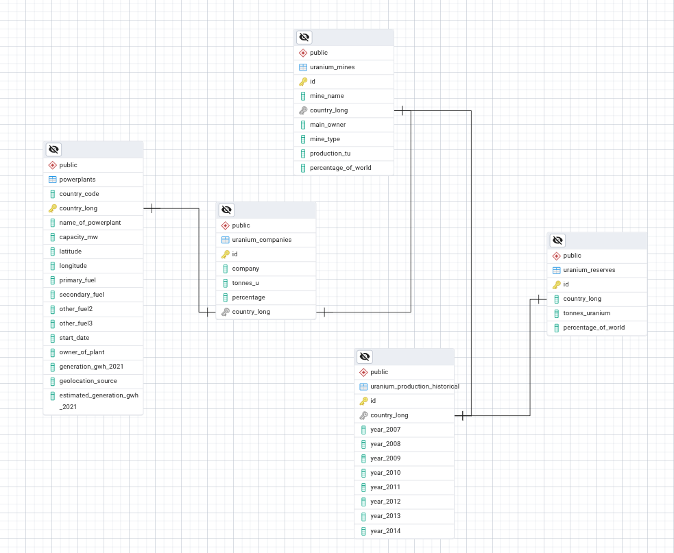

# SeverUranProm 🏭☢️

> **Uranium Production Analytics & Strategic Intelligence**

[](https://opensource.org/licenses/MIT)
[](https://github.com/SeverUranProm)
[](https://github.com/SeverUranProm)
[](https://github.com/SeverUranProm)

## 🎯 About

SeverUranProm is a specialized consulting and analytics firm dedicated to providing comprehensive intelligence and strategic insights in the global uranium production sector. Founded by industry veterans with deep expertise in nuclear fuel cycle economics, our company serves mining companies, energy utilities, financial institutions, and government agencies seeking to navigate the complex uranium market landscape.

## 🚀 Core Services

### 📊 Production Analytics & Forecasting
- Advanced modeling of uranium production capacity
- Reserve assessments and resource evaluation
- Supply-demand forecasting across major producing regions
- Mine-level production optimization analysis

### 📈 Market Intelligence
- Real-time uranium pricing and contract tracking
- Trade flow analysis and supply chain mapping
- Market structure analysis with focus on Central Asian markets
- Regulatory and policy impact assessment

### ⚠️ Risk Assessment
- Geopolitical risk modeling for uranium investments
- Regulatory compliance and environmental risk analysis
- Operational risk assessment for mining projects
- Supply chain vulnerability analysis

### 💼 Strategic Advisory
- M&A due diligence and transaction support
- Joint venture structuring and partnership advisory
- Strategic planning for uranium sector participants
- Investment thesis development and validation

## 🌍 Regional Expertise

| Region | Coverage | Specialization |
|--------|----------|----------------|
| 🇰🇿 Kazakhstan | **Primary** | Production analytics, market intelligence |
| 🇷🇺 Russia | **Primary** | Trade flows, regulatory analysis |
| 🇨🇦 Canada | Secondary | Technical analysis, ESG compliance |
| 🇦🇺 Australia | Secondary | Resource assessment, market trends |
| 🇳🇪 Niger | Monitoring | Geopolitical risk, production disruption |

## 📊 Key Differentiators

- **🎯 Specialized Focus**: Exclusive concentration on uranium sector analytics
- **📍 Regional Expertise**: Deep knowledge of Central Asian and CIS uranium markets
- **🔢 Proprietary Data**: Comprehensive database tracking 200+ uranium projects globally
- **🤝 Industry Networks**: Established relationships with major producers, traders, and end-users
- **📈 Proven Track Record**: Guided over $2B in uranium sector investments

## 🏢 Our Impact

```
$2B+ in guided uranium investments
50+ major strategic decisions supported
200+ uranium projects tracked globally
15+ years of combined team experience
```

## 📧 Contact Information

**🏠 Headquarters**
```
SeverUranProm LLP
Almaty, Kazakhstan
📧 info@severuranprom.kz
📞 +7 (727) 000-0000
```

**🌐 Regional Offices**
- **Almaty, Kazakhstan** - CIS Market Intelligence
- **Toronto, Canada** - North American Operations  
- **London, UK** - European Client Services

## 🤝 Connect With Us

[](https://linkedin.com/company/severuranprom)
[](https://twitter.com/severuranprom)
[](https://severuranprom.com)
[](mailto:info@severuranprom.kz)

## 🏆 Recognition

- **2023**: *"Leading Uranium Analytics Firm"* - Nuclear Industry Association
- **2022**: *"Best Market Intelligence Provider"* - Central Asia Mining Forum
- **2021**: *"Excellence in Nuclear Sector Advisory"* - Kazakhstan Chamber of Commerce

## 🗄️ Database Schema



## 🔧 Configuration

### Environment Variables (.env):
Create a `.env` file in the project root with the following variables:

```bash
DB_HOST=XXXXX
DB_PORT=XXXXX
DB_NAME=XXXXX
DB_USER=XXXXX
DB_PASSWORD=XXXXX

GRAFANA_SMTP_ENABLED=true
GRAFANA_SMTP_HOST=smtp.gmail.com:587
GRAFANA_SMTP_USER=XXXXX
GRAFANA_SMTP_PASSWORD=XXXXX
GRAFANA_SMTP_FROM_ADDRESS=XXXXX
GRAFANA_SMTP_FROM_NAME=Grafana
GRAFANA_SMTP_STARTTLS_POLICY=Mandatory
GRAFANA_SMTP_SKIP_VERIFY=false

GRAFANA_ADMIN_USER=admin
GRAFANA_ADMIN_PASSWORD=admin

POSTGRES_HOST=XXXXX
POSTGRES_PORT=XXXXX
POSTGRES_DB=XXXXX
POSTGRES_USER=XXXXX
POSTGRES_PASSWORD=XXXXX

OPENWEATHER_API_KEY=XXXXX
```

### Setup:
```bash
python3 -m venv venv
source venv/bin/activate

pip install -r config/requirements.txt

python3 scripts/main.py
```

## 📊 Monitoring Stack (Prometheus & Grafana)

### Prerequisites
- Local PostgreSQL running on configured port
- Database exists with tables
- Docker and Docker Compose installed

### Start All Services
```bash
cd monitoring && docker compose up -d
```

### Stop All Services
```bash
cd monitoring && docker compose down
```

### Restart All Services
```bash
cd monitoring && docker compose restart
```

### Rebuild Custom Exporter (if code changed)
```bash
cd monitoring && docker compose build custom_exporter && docker compose up -d custom_exporter
```

### Check Container Status
```bash
docker ps
```

### Generate Database Load (Optional)
```bash
source /path/to/venv/bin/activate && python3 scripts/generate_load.py
```

### Access URLs
- **Grafana**: http://localhost:3000 (XXXXX/XXXXX)
- **Prometheus**: http://localhost:9090
- **PostgreSQL Exporter**: http://localhost:9187/metrics
- **Node Exporter**: http://localhost:9100/metrics
- **Custom Exporter**: http://localhost:8000/metrics

### Access Information:
- **Superset**: http://localhost:8088
- **PostgreSQL**: XXXXX:XXXXX
- **Database**: XXXXX
- **Credentials**: XXXXX/XXXXX
